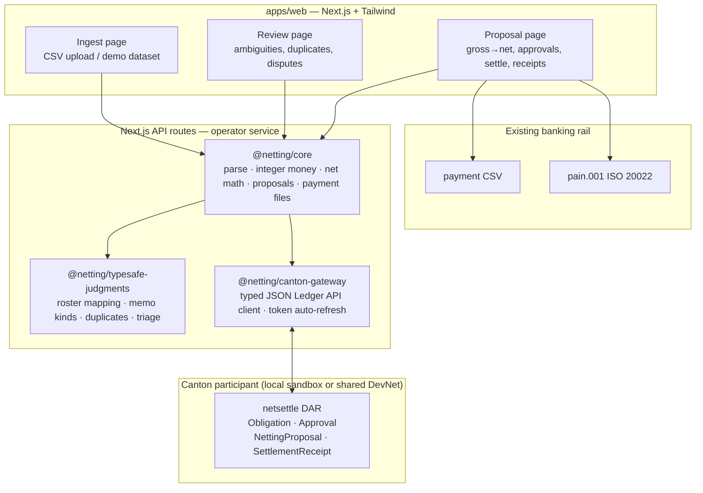
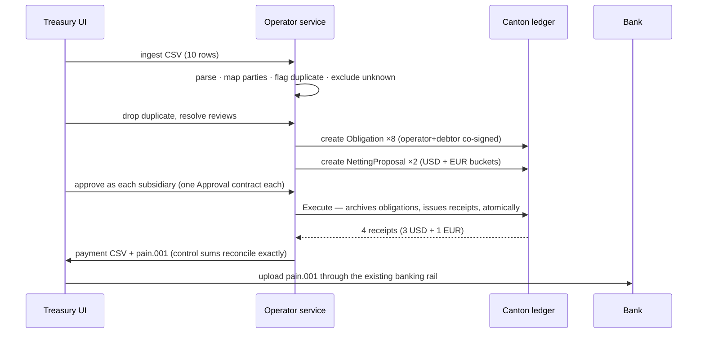
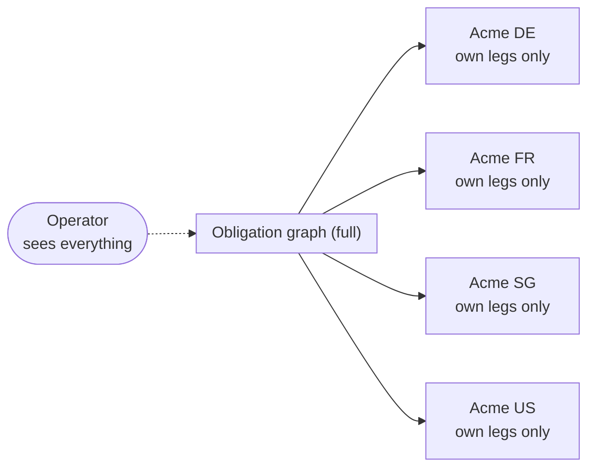

# NetSettle — intercompany multilateral netting on Canton

> **Track 1 · RWA & Business Workflows — HackCanton Season 3**
> Live demo: https://100-30-125-235.nip.io · Pitch: [PITCH.md](./PITCH.md) ·
> Validation: [VALIDATION.md](./VALIDATION.md) · DevNet: [DEVNET.md](./DEVNET.md)

Subsidiaries of one group owe each other millions across entities. Much of it is
circular — A owes B, B owes C, C owes A — so the group settles gross and leaves
working capital trapped in cycles that mathematically cancel out. The monthly
netting cycle still runs on spreadsheets and email.

NetSettle ingests intercompany payables, resolves messy counterparty names
against the subsidiary roster, compresses offsetting cycles, collects
per-subsidiary approvals, and settles the residual in **one atomic Canton
transaction** — with each subsidiary seeing only its own legs. Settlement ends
in a **bank-ready payment file** (CSV + ISO 20022 pain.001).

Demo: **10 payables rows ingested → 8 eligible across two currency buckets**
(one near-duplicate dropped in review, one unknown counterparty excluded):
USD bucket $312,000 gross → $40,000 net in 3 transfers; EUR bucket €70,000
gross → €30,000 net in 1 transfer. No FX conversion — like offsets like.

---

## 1. Thesis

### What

A monthly netting workstation for group treasury: ingest → review → propose →
approve → atomically settle → export the bank file. One corporate group is the
whole beachhead — one signature onboards every subsidiary.

### Why

Three facts, each cited in [VALIDATION.md](./VALIDATION.md):

1. **The pain is measured, not vibes.** 88% of finance teams report
   payment-operations problems; 51% do up to half manually; 1-in-9 have fully
   automated disbursements.
2. **The ROI is quantified.** Netting cuts cross-border transfers by up to 70%
   and hedge trades by up to 75%. Named treasurers (Weir, Bandwidth, Innospec)
   describe the spreadsheet cycle in their own words.
3. **The budget exists.** 84% of companies invested in payment operations in
   the last 12–18 months.

### How

Two properties make netting hard, and each maps to exactly one Canton
primitive:

| Hard problem | Canton answer | Where in this repo |
|---|---|---|
| Nobody publishes their payables ledger (an AP file reveals suppliers, pricing, margins) | Stakeholder-scoped visibility: subsidiaries see only contracts they are party to | `Obligation` observers, `/api/view` per-party reads |
| Multilateral settlement must be all-or-nothing (partial execution recreates settlement risk) | One atomic transaction archives every obligation and issues every receipt; a failed leg aborts everything | `NettingProposal.Execute`, `testExecuteBlocked` |

Everything else — CSV parsing, money math, cycle detection, approvals UI,
payment files — is ordinary software, kept deliberately boring.

### Why now

Canton's JSON Ledger API + Daml 3.x make a small team able to ship a real
multi-party workflow in weeks; the Season 3 shared DevNet node removes the
infrastructure excuse entirely (we settled live on it — see
[DEVNET.md](./DEVNET.md)); and TypeSafe's judgment primitives make messy
treasury input tractable without an ML project. None of this stack existed in
this form two years ago.

### Honest trust boundary

Canton is not MPC or ZK. Cycle detection runs over the full obligation graph,
so the **operator sees everything** — the same trust position as a central
netting operator today. What Canton buys: *participants are private from each
other*, and *settlement is atomic*. The privacy demo queries the ledger live
per party so this claim is checkable, not asserted.

---

## 2. Architecture

### System overview



Money math, cycle detection, and proposal state live in deterministic
TypeScript (`@netting/core`) — no floats (integer minor units throughout), no
model calls. TypeSafe answers four narrow semantic questions (which roster
party? what kind of memo? same obligation? how risky is this batch?), each
confidence-gated to human review with a deterministic offline fallback. The
gateway is the only component that touches the ledger.

### Settlement sequence (the atomic core)



### Trust boundary



Enforced by Daml signatories/observers, verified live per party via
`/api/view` (ledger-queried counts, not UI assertions).

---

## 3. Why Canton

NetSettle only works because the ledger does two things a database cannot.
Everything below is load-bearing — nothing here is a logo, and each row shows
*how* the piece works inside the product, not just that it's used.

| Capability | Why the product needs it | How it works here |
|---|---|---|
| **Stakeholder privacy (Daml)** | Subsidiaries will never upload payables to a system where counterparties can read them — an AP file leaks suppliers, pricing, margins | `Obligation` is signed by operator + debtor and merely *observed* by the creditor; receipts are observed only by their two parties. Nobody else on the ledger sees them. Verified live per party via `/api/view` |
| **Atomic multi-party execution** | Netting N obligations in gross means N chances for partial failure; a half-settled cycle is worse than none | `NettingProposal.Execute` archives every obligation and issues every receipt in a single transaction — one failed approval aborts the whole commit (`testExecuteBlocked` proves it) |
| **Daml 3.x contracts** | The netting commit must be enforceable by the ledger, not by our backend's good behavior | `Obligation / Approval / NettingProposal / SettlementReceipt` in `daml/`; `dpm test` green |
| **JSON Ledger API** | The treasury UI must create, approve, execute, and audit without running a node | Typed gateway (`packages/canton-gateway`): creates, choice exercises, template-filtered ACS reads, ledger-end offsets, Bearer + auto-refresh auth |
| **Shared DevNet node (Noders)** | A hackathon claim of "atomic settlement" is only credible on shared infrastructure | Full flow settled on `hackcanton-01`: EUR €70k→€30k + USD $312k→$40k, receipts verified — see [DEVNET.md](./DEVNET.md) |
| **DevNet OIDC + offline refresh** | A demo that needs a human login every 3 hours is not a live product | Password grant → non-expiring refresh token; gateway refreshes the access token indefinitely (`tokenRefresh.ts`, 4 tests) |
| **Local sandbox** | Judges and developers must reproduce the demo without credentials or network | `scripts/bootstrap-sandbox.sh` — one command to a fresh ledger, parties, and app config |
| **TypeSafe (AI track)** | Treasury CSVs are messy in ways regex can't cover: `Acme france`, duplicate-ish refs, cryptic memos | Roster mapping, memo classification, duplicate probability, batch triage — each confidence-gated to human review with deterministic fallback (`packages/typesafe-judgments`, 6 tests) |
| **Season 3 program** | A product without a track, spine, and users is a demo | Track 1; Value→ICP→Metrics→GTM→MVP→Pitch mapped in [PITCH.md](./PITCH.md); shared-node endpoints from the materials |

Explicitly **not** used (and why): Grofty wallet bounty (our approvals are
server-mediated in the MVP; wallet-signed approvals via CIP-103 are roadmap),
OneSwap/AMM infra (no trading in a netting product), new tokens (the payment
file carries value through existing rails — minting one would be a gimmick).

---

## 4. Vision & roadmap

**Thesis in one line:** every multinational already runs this cycle; the winner
turns the spreadsheet ritual into a one-click atomic operation, then owns the
intercompany data layer it creates.

| Phase | Scope | Status |
|---|---|---|
| **0 — Hackathon MVP** | Single-group, manual CSV, per-currency buckets, disputes, payment CSV + pain.001, local + DevNet ledgers | ✅ shipped |
| **1 — Pilot-ready** | ERP import (SAP/Oracle formats), scheduled cycles, email notifications, multi-group workspaces, 5 operator pilots (see [OUTREACH.md](./OUTREACH.md)) | next |
| **2 — Wallet-signed approvals** | Subsidiaries approve from Grofty/Cauri via CIP-103 instead of server-mediated clicks — also unlocks the wallet bounty lane | planned |
| **3 — FX-aware netting** | Quoted-rate locking per bucket with an FX oracle + auditor observer, turning cross-currency cycles into one commit | planned |
| **4 — Network** | Netting-center-as-a-service for mid-caps without treasury IT; Featured App path on MainNet; usage-based pricing anchored to eliminated FX/bank fees | vision |

**Moat as it compounds:** each cycle's resolved mappings, dispute history, and
counterparty graph are proprietary workflow data no TMS export contains —
retention through accumulated context, not lock-in theater.

---

## 5. Repository layout

| Path | What it is |
|---|---|
| `daml/` | `Netting.daml` — Obligation / Approval / NettingProposal / SettlementReceipt; `NettingTest.daml` — positive + blocked-execution ledger tests |
| `packages/netting-core` | Deterministic engine: CSV ingest, integer minor-unit money, net-position math, per-currency buckets, proposal state machine, payment CSV + pain.001. No floats, no AI. |
| `packages/typesafe-judgments` | TypeSafe System One judgments: roster mapping (Choice), memo classification (Choice), near-duplicate probability (Noul), batch triage (Score). Confidence-gated to human review, with deterministic offline fallback. |
| `packages/canton-gateway` | Typed Canton JSON Ledger API client, Bearer auth, offline-refresh `TokenManager` + live round-trip test. |
| `apps/web` | Treasury workflow UI (Tailwind + Space Grotesk/Inter/JetBrains Mono): ingest → review → propose → approve → settle → receipts, payment downloads, per-subsidiary privacy views, favicon + OG image. |
| `scripts/` | `bootstrap-sandbox.sh` (fresh demo env), `sync-ledger.sh` (rebuild → upload → vet → point app at new package id), `devnet-deploy.sh` (shared-node deploy), `ec2-user-data.sh` (host toolchain). |

## Validation

Problem and budget evidence is compiled in [VALIDATION.md](./VALIDATION.md) —
treasury surveys (Modern Treasury/Harris, KPMG, EACT, Deluxe), quantified
netting ROI (up to 70% fewer cross-border transfers), named treasurer quotes,
and an explicit list of what remains unvalidated. No fabricated interviews:
direct operator conversations are the first post-hackathon task, with an
outreach kit in [OUTREACH.md](./OUTREACH.md).

## Run the demo

Prerequisites: Docker? No — just `dpm`, Node 22, pnpm. The sandbox is a single
JVM process.

```bash
# 1. Fresh local ledger + parties + app config (takes ~2 minutes)
bash scripts/bootstrap-sandbox.sh

# 2. All green before you demo
pnpm --filter @netting/core test
pnpm --filter @netting/typesafe-judgments test
pnpm --filter @netting/canton-gateway test
cd daml && dpm test

# 3. Start the app
pnpm --filter @netting/web start   # http://localhost:3100
```

Demo flow: **Ingest → Load demo dataset → Review** (drop the flagged
duplicate `INV-001-R`; `Globex Corp` stays unresolved and is excluded) →
**Proposal → Create netting proposals → approve as all four subsidiaries →
Execute atomic settlement** (USD + EUR buckets). Then attempt a settlement with
approvals missing to show the refusal, download the payment files, and switch
subsidiary views to show each party sees only its own legs — verified live
against the ledger.

`TYPESAFE_API_KEY` is read from the environment. Without it the app still runs
on the deterministic fallback and marks judgments for review.

## Verification evidence

- `dpm test`: `testExecute` (2 receipts, obligations archived) and
  `testExecuteBlocked` (missing approval fails, nothing partially settles).
- `packages/canton-gateway` live test (gated by `CANTON_*` env): full cycle
  against a real participant, asserting archival of exactly the created
  obligations.
- `/api/view?party=` returns per-party ledger-verified counts alongside the
  scoped view.
- `/api/payment-file?proposalId=` downloads the bank payment CSV (or
  `&format=pain001` for ISO 20022); totals reconcile exactly with the net
  settlement amount.
