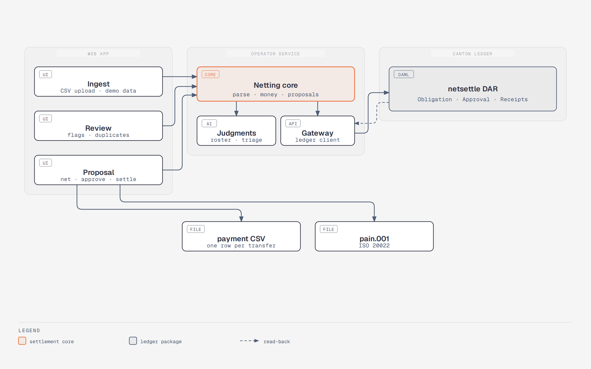
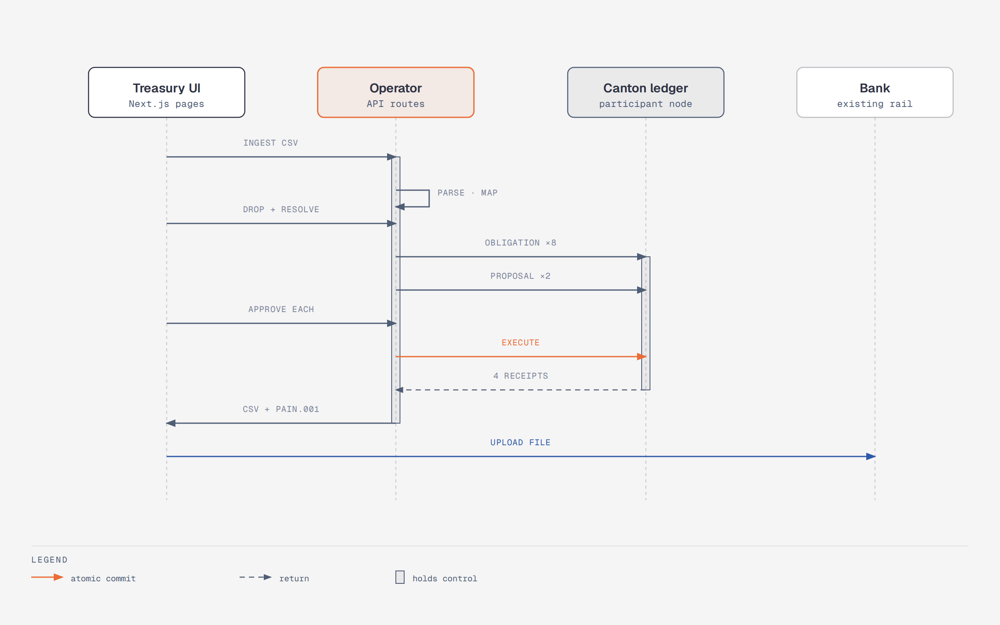
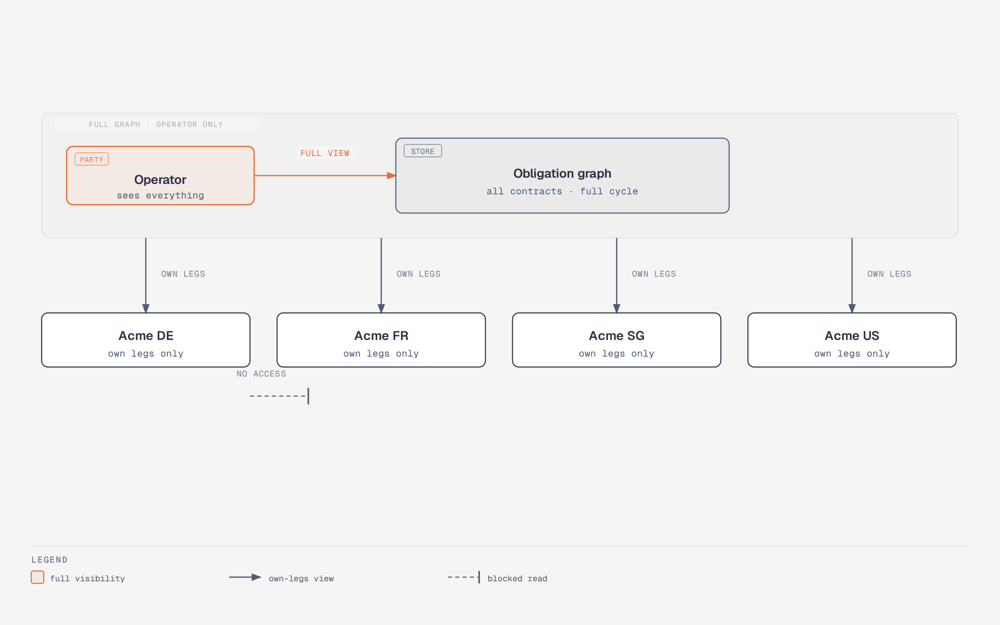

# NetSettle — intercompany multilateral netting on Canton

> **Track 1 · RWA & Business Workflows — HackCanton Season 3**
> Live demo: https://100-30-125-235.nip.io · Pitch: [PITCH.md](./PITCH.md) ·
> Submission kit: [SUBMISSION.md](./SUBMISSION.md) ·
> Validation: [VALIDATION.md](./VALIDATION.md) · DevNet: [DEVNET.md](./DEVNET.md) ·
> Decentralized-party demo: [dp/README.md](./dp/README.md)

Subsidiaries of one group owe each other millions across entities. Much of it is
circular — A owes B, B owes C, C owes A — so the group settles gross and leaves
working capital trapped in cycles that mathematically cancel out. The monthly
netting cycle still runs on spreadsheets and email.

NetSettle ingests intercompany payables, resolves messy counterparty names
against the subsidiary roster, compresses offsetting cycles, collects
per-subsidiary approvals, and settles the residual in **one atomic Canton
transaction** — with each subsidiary seeing only its own legs. Settlement ends in
a **bank-ready payment file** (CSV + ISO 20022 pain.001).

The netting operator is the party that sees the whole obligation graph and whose
signature commits a settlement — so it is the last party that should sit under
one host's control. This repo covers both halves of that: the product, and the
operator running as a **2-of-2 Canton Decentralized Party** whose authority no
single host can exercise.

---

## Contents

1. [What the demo shows](#1-what-the-demo-shows)
2. [Thesis](#2-thesis)
3. [Architecture](#3-architecture)
4. [Trust boundary](#4-trust-boundary)
5. [Why Canton](#5-why-canton)
6. [The netting operator as a Decentralized Party](#6-the-netting-operator-as-a-decentralized-party)
7. [Roadmap](#7-roadmap)
8. [Repository layout](#8-repository-layout)
9. [Run it](#9-run-it)
10. [Verification evidence](#10-verification-evidence)

---

## 1. What the demo shows

**10 payables rows ingested → 8 eligible across two currency buckets** (one
near-duplicate dropped in review, one unknown counterparty excluded):

| Bucket | Gross | Net | Transfers |
|---|---|---|---|
| USD | $312,000 | **$40,000** | 3 |
| EUR | €70,000 | **€30,000** | 1 |

No FX conversion — like offsets like. A fully-circular bucket settles with
**zero transfers**: obligations archived atomically, nothing moved.

> **Judges — the 90-second path.** Problem and thesis → §2 · Why Canton is
> load-bearing → §5 · Live DevNet evidence → [DEVNET.md](./DEVNET.md) ·
> Decentralization Manager integration → §6 · Submission kit → [SUBMISSION.md](./SUBMISSION.md) ·
> Run it from zero → §9.

**Verified, not asserted:**

- 20 core · 8 judgment · 7 gateway · 4 Daml tests green.
- Full cycle settled on the **shared DevNet node** (`hackcanton-01`), with
  receipts read back from the ledger.
- Privacy isolation proven live, queried **as each party**, against the session's
  own batch.
- A **2-of-2 decentralized party** created on a Canton ledger, where a governed
  settlement is **refused to the host that proposed it** and executed only once
  both members confirm — with receipts signed by the party.

---

## 2. Thesis

### What

A monthly netting workstation for group treasury: ingest → review → propose →
approve → atomically settle → export the bank file. One corporate group is the
whole beachhead — one signature onboards every subsidiary.

### Why

Three facts, each cited in [VALIDATION.md](./VALIDATION.md):

1. **The pain is measured, not vibes.** 88% of finance teams report
   payment-operations problems; 51% do up to half manually; 1-in-9 have fully
   automated disbursements.
2. **The ROI is quantified.** Netting cuts cross-border transfers by up to 70%
   and hedge trades by up to 75%. Named treasurers (Weir, Bandwidth, Innospec)
   describe the spreadsheet cycle in their own words.
3. **The budget exists.** 84% of companies invested in payment operations in the
   last 12–18 months.

No fabricated interviews: direct operator conversations are the first
post-hackathon task, with an outreach kit in [OUTREACH.md](./OUTREACH.md).

### How

Two properties make netting hard, and each maps to exactly one Canton
primitive:

| Hard problem | Canton answer | Where in this repo |
|---|---|---|
| Nobody publishes their payables ledger (an AP file reveals suppliers, pricing, margins) | Stakeholder-scoped visibility: subsidiaries see only contracts they are party to | `Obligation` observers, `/api/view` per-party reads |
| Multilateral settlement must be all-or-nothing (partial execution recreates settlement risk) | One atomic transaction archives every obligation and issues every receipt; a failed leg aborts everything | `NettingProposal.Execute`, `testExecuteBlocked` |
| A single operator host can commit a settlement nobody else approved | Threshold-governed authority: the operator's signing keys split across independent nodes | `dp/` — `GovernableAction`, `settle-as-decentralized-party.sh` |

Everything else — CSV parsing, money math, cycle detection, approvals UI,
payment files — is ordinary software, kept deliberately boring.

### Why now

Canton makes a small team able to ship a real multi-party workflow in weeks; the
Season 3 shared DevNet node removes the infrastructure excuse entirely (we
settled live on it); BitSafe's Decentralization Manager makes splitting an
operator's authority across independent nodes a configuration exercise rather
than a cryptography project; and TypeSafe's judgment primitives make messy
treasury input tractable without an ML project. None of this stack existed in
this form two years ago.

---

## 3. Architecture

[](./docs/diagrams/architecture.html)

*Three pages feed one deterministic core, which consults judgments, commits
through the ledger gateway, and exports bank artifacts. Click through for the
interactive version.*

Money math, cycle detection, and proposal state live in deterministic
TypeScript (`@netting/core`) — no floats (integer minor units throughout), no
model calls. TypeSafe answers four narrow semantic questions (which roster
party? what kind of memo? same obligation? how risky is this batch?), each
confidence-gated to human review with a deterministic offline fallback. The
gateway is the only component that touches the ledger.

### Settlement sequence (the atomic core)

[](./docs/diagrams/settlement-sequence.html)

*Ten messages from ingest to bank upload, ending in one atomic Execute. Click
through for the interactive version.*

---

## 4. Trust boundary

Netting has **two** trust questions, and they are independent. Being precise
about both is the point of this section.

### 4.1 What each party can see

[](./docs/diagrams/trust-boundary.html)

*The operator holds full visibility while each subsidiary sees only its own
legs; cross-reads stop at the boundary. Click through for the interactive
version.*

Subsidiaries are private **from each other**, enforced by Daml
signatories/observers and verified live per party via `/api/view`: the endpoint
queries the ledger **as that party** and proves isolation against this session's
own batch — every receipt involving the party is readable, every same-batch
receipt that does not involve it is absent. Raw ledger-wide counts are
deliberately not used: the shared node also carries other runs' contracts, so
they would prove nothing about isolation.

**The operator still sees everything.** Cycle detection runs over the full
obligation graph, so the operator sits in the same trust position as a central
netting operator does today. Canton is not MPC or ZK, and this repo does not
pretend otherwise.

### 4.2 Who controls the operator

The second question is separate and was ignored for most of the product's life:
even if the operator is honest, **who can make it settle?**

Previously: one process held the keys that authorise `Execute`. Anyone who
controlled that process could settle any cycle. Now the netting operator is a
**2-of-2 Canton Decentralized Party** — see §6. Neither host can settle alone.

### 4.3 Stated limits

Known MVP limitations, up front rather than buried:

- The demo app is **unauthenticated** (public judging), and the operator service
  holds all party credentials server-side, so approvals are server-mediated.
  Wallet-signed approvals via CIP-103 are roadmap.
- The shared DevNet node is **public**, so nothing confidential belongs in it.
- The governed settlement path (`dp/`) runs on a **local LocalNet**; the live
  public demo runs the single-party path. §6 is additive, not a swap.
- No real money moves, and no personal data is stored.

---

## 5. Why Canton

NetSettle only works because the ledger does things a database cannot.
Everything below is load-bearing — nothing here is a logo, and each row shows
*how* the piece works inside the product, not just that it's used.

| Capability | Why the product needs it | How it works here |
|---|---|---|
| **Stakeholder privacy (Daml)** | Subsidiaries will never upload payables to a system where counterparties can read them — an AP file leaks suppliers, pricing, margins | `Obligation` is signed by operator + debtor and merely *observed* by the creditor; receipts are observed only by their two parties. Verified live per party via `/api/view` |
| **Atomic multi-party execution** | Netting N obligations in gross means N chances for partial failure; a half-settled cycle is worse than none | `NettingProposal.Execute` archives every obligation and issues every receipt in a single transaction — one failed approval aborts the whole commit (`testExecuteBlocked`). A fully-cancelling cycle settles with zero receipts (`testExecuteFullNetting`) |
| **Approvals bound to terms** | An approval for "proposal 7" is worthless if proposal 7 can be rewritten after the fact | Every approval carries the SHA-256 of the canonical proposal terms; `Execute` refuses any approval whose hash doesn't match (`testExecuteBlockedOnTermsMismatch`) |
| **Decentralized Parties (Canton native)** | An operator whose settlement keys sit on one host is a single point of failure for the whole cycle | The netting operator is a real 2-of-2 party on the ledger; its namespace needs both members' signatures, and the settlement's `GovernableAction_Execute` is **controlled** by that party (§6) |
| **Daml 3.x contracts** | The netting commit must be enforceable by the ledger, not by our backend's good behavior | `Obligation / Approval / NettingProposal / SettlementReceipt` in `daml/`; `dpm test` green |
| **JSON Ledger API** | The treasury UI must create, approve, execute, and audit without running a node | Typed gateway (`packages/canton-gateway`): creates, choice exercises, template-filtered ACS reads, ledger-end offsets, Bearer + auto-refresh auth |
| **Shared DevNet node (Noders)** | A hackathon claim of "atomic settlement" is only credible on shared infrastructure | Full flow settled on `hackcanton-01`: EUR €70k→€30k + USD $312k→$40k, receipts verified — [DEVNET.md](./DEVNET.md) |
| **DevNet OIDC + offline refresh** | A demo that needs a human login every 3 hours is not a live product | Password grant → non-expiring refresh token; gateway refreshes indefinitely (`tokenRefresh.ts`) |
| **Local sandbox** | Judges and developers must reproduce the demo without credentials or network | `scripts/bootstrap-sandbox.sh` — one command to a fresh ledger, parties, and app config |
| **TypeSafe (AI track)** | Treasury CSVs are messy in ways regex can't cover: `Acme france`, duplicate-ish refs, cryptic memos | Roster mapping, memo classification, duplicate probability, batch triage — each confidence-gated with deterministic fallback (`packages/typesafe-judgments`) |
| **Season 3 program** | A product without a track, spine, and users is a demo | Track 1; Value→ICP→Metrics→GTM→MVP→Pitch in [PITCH.md](./PITCH.md) |

Explicitly **not** used (and why): OneSwap/AMM infrastructure (no trading in a
netting product), new tokens (the payment file carries value through existing
rails — minting one would be a gimmick). The Grofty wallet bounty needs MainNet
and invitation-gated access; wallet-signed approvals are Phase 2 regardless.

---

## 6. The netting operator as a Decentralized Party

Full detail, including how to run it, is in **[dp/README.md](./dp/README.md)**.
The short version:

```
netsettle-operator::1220c096f43bba0d44b93798c731ac3a6a4c66e4ff2587b44d371ba2a0ee3500453b
threshold 2   ·   owners 2   ·   members: app_provider…, app_user…
```

The operator's settlement logic is expressed as a `GovernableAction`, the
interface `Governance.Rules` exercises once `threshold` members confirm.
`GovernableAction_Execute` is declared with `controller (view this).governanceParty`,
so `executeImpl` runs **as the party**.

`dp/settle-as-decentralized-party.sh` runs the whole thing and asserts both
halves:

```
==> host A tries to execute the settlement it just proposed
    -> REFUSED. Daml named the party whose authority was required:
       ...:GovernedSettlement) requires authorizers
       netsettle-operator::1220c096…, but only app_provider_builder-localnet-1… were given

==> each member confirms the proposal through the Decentralization Manager
    host A confirm -> ok        confirmations: 1 of 2
    host B confirm -> ok        confirmations: 2 of 2

==> the DM executes the proposal as the operator party
    can_execute: True
    execute -> {"message": "Action executed successfully"}

==> did the settlement actually happen under the party?
    receipt      0042c6af…  100000 EUR  signed by netsettle-operator::1220c096…
    obligation   006483a4… consumed (Settle exercised, archived)

PASS (exit 0)
```

Both refusals come from **Daml on the ledger**, not from our application — which
matters, because an application-level check can be edited past by whoever
controls the application.

### What is claimed, and what is not

- **Claimed and demonstrated — shared control.** A governed settlement cannot
  execute below the confirmation threshold and succeeds once it is met. Shown at
  both the governance layer and the settlement layer, with exit-code-asserting
  scripts.
- **Not claimed — distributed hosting.** Behaviour when a hosting node goes
  offline is not demonstrated, so no availability claim is made. Stopping one of
  two nodes on one machine would show a signature is required but says nothing
  about machine-level outage tolerance.

### On "independent operators", precisely

The two members are separate Canton participants with separate host keys,
separate namespaces, and separate Decentralization Manager instances reaching
each other only over an encrypted Noise mesh. **Neither can sign for the party
alone** — verified: submitting as the party from either participant alone is
refused with `HTTP 403`.

But in this LocalNet demo **both are operated by us, on one machine**. What is
demonstrated is *cryptographic* independence of keys and the threshold rule — not
*organisational* independence. In a real deployment the members would be separate
organisations with separate infrastructure. Stating the limit is better than
letting a reader assume more than we showed.

---

## 7. Roadmap

**Thesis in one line:** every multinational already runs this cycle; the winner
turns the spreadsheet ritual into a one-click atomic operation, then owns the
intercompany data layer it creates.

| Phase | Scope | Status |
|---|---|---|
| **0 — Hackathon MVP** | Single-group, manual CSV, per-currency buckets, disputes, payment CSV + pain.001, local + DevNet ledgers | ✅ shipped |
| **0b — Governed operator** | Netting operator as a 2-of-2 Decentralized Party; settlement refused to a single host; receipts signed by the party | ✅ shipped (`dp/`) |
| **1 — Pilot-ready** | ERP import (SAP/Oracle), scheduled cycles, email notifications, multi-group workspaces, 5 operator pilots ([OUTREACH.md](./OUTREACH.md)) | next |
| **2 — Wallet-signed approvals** | Subsidiaries approve from Grofty/Cauri via CIP-103 instead of server-mediated clicks | planned |
| **3 — FX-aware netting** | Quoted-rate locking per bucket with an FX oracle + auditor observer, turning cross-currency cycles into one commit | planned |
| **4 — Independent operators** | Run the operator party across genuinely separate organisations, and publish availability under the hosting threshold | vision |
| **5 — Network** | Netting-centre-as-a-service for mid-caps without treasury IT; Featured App path on MainNet | vision |

**Moat as it compounds:** each cycle's resolved mappings, dispute history, and
counterparty graph are proprietary workflow data no TMS export contains —
retention through accumulated context, not lock-in theater.

---

## 8. Repository layout

| Path | What it is |
|---|---|
| `daml/` | `Netting.daml` — Obligation / Approval / NettingProposal / SettlementReceipt; `NettingTest.daml` — positive and blocked-execution ledger tests |
| `dp/` | **BitSafe track.** The netting operator as a 2-of-2 Decentralized Party: LocalNet + Decentralization Manager bring-up, party onboarding, a governed settlement package, and asserting proofs. Start at [dp/README.md](./dp/README.md) |
| `packages/netting-core` | Deterministic engine: CSV ingest, integer minor-unit money, net-position math, per-currency buckets, proposal state machine, payment CSV + pain.001. No floats, no AI |
| `packages/typesafe-judgments` | TypeSafe System One judgments: roster mapping, memo classification, near-duplicate probability, batch triage — confidence-gated, with deterministic offline fallback |
| `packages/canton-gateway` | Typed Canton JSON Ledger API client, Bearer auth, offline-refresh `TokenManager` |
| `apps/web` | Treasury workflow UI: ingest → review → propose → approve → settle → receipts, payment downloads, per-subsidiary privacy views |
| `scripts/` | `bootstrap-sandbox.sh`, `sync-ledger.sh`, `devnet-deploy.sh`, `ec2-user-data.sh` |

---

## 9. Run it

### 9.1 The product

Prerequisites: `dpm` (with a JDK), Node 22, pnpm 10. No Docker — the sandbox is a
single JVM process.

```bash
# 0. Workspace dependencies (once)
pnpm install --frozen-lockfile

# 1. Fresh local ledger + parties + app config (~2 minutes)
bash scripts/bootstrap-sandbox.sh

# 2. All green before you demo
pnpm --filter @netting/core test
pnpm --filter @netting/typesafe-judgments test
pnpm --filter @netting/canton-gateway test
(cd daml && dpm test)

# 3. Build and start the app
pnpm --filter @netting/web build
pnpm --filter @netting/web start   # http://localhost:3100
```

Demo flow: **Ingest → Load demo dataset → Review** (drop the flagged duplicate
`INV-001-R`; `Globex Corp` stays unresolved and is excluded) → **Proposal →
Create netting proposals → approve as all four subsidiaries → Execute atomic
settlement**. Then attempt a settlement with approvals missing to show the
refusal, download the payment files, and switch subsidiary views to show each
party sees only its own legs — verified live against the ledger.

`TYPESAFE_API_KEY` is read from the environment. Without it the app still runs on
the deterministic fallback and marks judgments for review.

### 9.2 The governed operator

Prerequisites: Docker with Compose v2.1.1+, `curl`, `jq` ≥ 1.6, the Canton Builder
Tool and the Daml SDK (`dpm`). Roughly 8GB of RAM.

```bash
bash dp/reproduce.sh     # ~35 min first run; prints each step and stops on failure
```

Individual steps are in [dp/README.md](./dp/README.md). Teardown:
`bash dp/down.sh` (add `--purge` to delete the party and the ledger).

---

## 10. Verification evidence

**Tests** — 20 core · 8 judgment · 7 gateway · 4 Daml, all green.

- `dpm test`: `testExecute` (2 receipts, obligations archived),
  `testExecuteBlocked` (missing approval fails, nothing partially settles),
  `testExecuteBlockedOnTermsMismatch` (full approvals with a different terms hash
  cannot settle a rewritten proposal), `testExecuteFullNetting` (a fully
  cancelling cycle archives all obligations with zero transfers).
- `packages/canton-gateway` live test (gated by `CANTON_*`): full cycle against a
  real participant, asserting archival of exactly the created obligations.

**Live ledger reads**

- `/api/view?party=` returns the party-scoped view plus a same-batch isolation
  proof queried live as that party (own receipts readable, others' absent).
- `/api/payment-file?proposalId=` downloads the bank payment CSV (or
  `&format=pain001` for ISO 20022); totals reconcile exactly with the net
  settlement amount.
- Full cycle settled on the shared DevNet node — [DEVNET.md](./DEVNET.md).

**Decentralization** — each script exits non-zero if the property stops holding,
so these are testable rather than one-off observations.

- `dp/verify-operator.sh` — threshold 2 and two independent owners.
- `dp/prove-two-of-two.sh` — `Enough confirmations to execute action was not met`
  at one confirmation, then `Action executed successfully` at two.
- `dp/settle-as-decentralized-party.sh` — the host that proposed a settlement is
  refused with Daml naming the missing authorizer; both members confirm; the
  Decentralization Manager executes as the party; receipts are signed by the
  party and the obligation is consumed atomically.

**Problem evidence** — [VALIDATION.md](./VALIDATION.md) compiles treasury surveys
(Modern Treasury/Harris, KPMG, EACT, Deluxe), quantified netting ROI (up to 70%
fewer cross-border transfers), named treasurer quotes, and an explicit list of
what remains unvalidated.